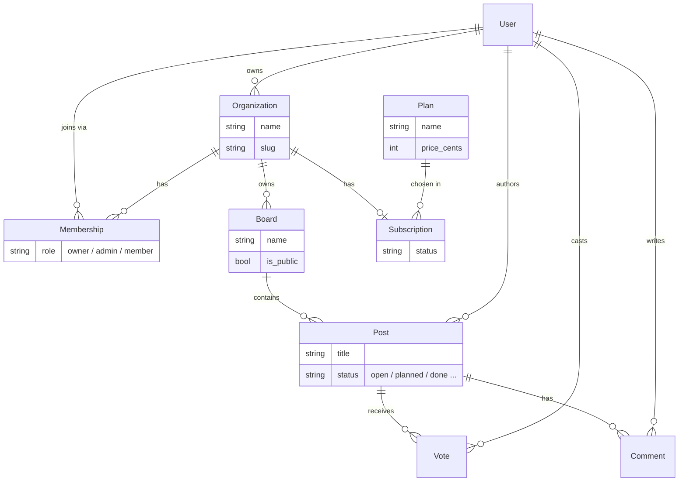

# Pulse API — a Django learning project

[](https://github.com/Jorgepele/pulse-api/actions/workflows/ci.yml)

> A small feedback & roadmap web API (teams post feature requests, users upvote them),
> built to practise Django, REST APIs and the MVC pattern beyond university coursework.
> Work in progress — I'm learning in the open.

> API web de feedback y hoja de ruta (los equipos publican peticiones y los usuarios votan),
> hecha para practicar Django, APIs REST y el patrón MVC más allá de las prácticas de clase.
> En desarrollo — aprendiendo sobre la marcha.

**Stack:** Python 3.14 · Django 6 · Django REST Framework · SQLite

---

## Live demo · Demo en vivo

Deployed on Render (free tier — the first request may take ~30 s while the
service wakes up):

- API root: **https://pulse-api-wmuq.onrender.com/**
- Interactive API docs (Swagger): **https://pulse-api-wmuq.onrender.com/api/docs/**

The React frontend that consumes it lives at
**https://pulse-web-lvhx.onrender.com** — log in with `demo@pulse.dev` / `demo12345`.

Desplegado en Render (plan gratis — la primera petición puede tardar ~30 s
mientras el servicio arranca). Frontend que la consume:
https://pulse-web-lvhx.onrender.com (`demo@pulse.dev` / `demo12345`).

---

## Why this project · Por qué este proyecto

I wanted a project bigger than a class exercise to actually understand how a web backend
fits together: designing the data model, separating concerns (models → serializers →
views), exposing a REST API, and covering it with tests. It's not a real product — it's a
place to learn.

Quería un proyecto más grande que un ejercicio de clase para entender de verdad cómo
encaja un backend web: diseñar el modelo de datos, separar responsabilidades
(modelos → serializers → vistas), exponer una API REST y cubrirla con tests. No es un
producto real, es un sitio para aprender.

## What it does so far · Qué hace por ahora

- Data model with users, organizations, boards, posts, votes and comments.
- Token-based authentication: register, login and a "current user" endpoint.
- REST API to list/create posts, toggle an upvote (one vote per user per post),
  and read/write comments.
- Subscription plans with a simulated subscribe endpoint for the demo, plus an
  optional real **Stripe Checkout** flow (test mode) behind an env flag — see
  [billing/BILLING.md](billing/BILLING.md).
- A `seed_demo` command that fills the database with a demo account, board,
  posts and plans so the API has something to show.
- Django admin to browse the data.
- 28 tests covering the domain rules, the API, auth and billing.

## Data model · Modelo de datos

The domain is multi-tenant: every board, post and subscription belongs to an
**organization**, and users join organizations through **memberships**.



A vote is unique per user per post (toggling removes it); a board's slug is
unique within its organization.

### Tenant visibility · Visibilidad entre tenants

Being multi-tenant is not just having an `organization` column — one tenant must
not be able to read another's data. The rule lives in a single place,
`BoardQuerySet.visible_to` (`feedback/models.py`), and everything else derives
from it:

- A **board** is visible if it is public, or if you belong to the organization
  that owns it. Posts and comments inherit their board's visibility.
- Anyone signed in may post and comment on a **public** board — that's the
  product (a public roadmap, like Canny).
- Creating a board inside an organization requires being a **member** of it.

Ser multi-tenant no es tener una columna `organization`: un tenant no debe poder
leer los datos de otro. La regla vive en un solo sitio, `BoardQuerySet.visible_to`,
y las vistas y serializers cuelgan de ella.

## What I learned / practised · Qué he aprendido

- Structuring a Django project into apps and following the MVC/MVT separation.
- Building a REST API with Django REST Framework (serializers, viewsets, routers).
- Modelling relationships (foreign keys, many-to-many through a join model).
- Writing tests with Django's test client.
- Spotting and fixing an **N+1 query**: the post list used to run extra queries per
  post for its vote count, comment count and `has_voted`. They are now `annotate`d
  onto the queryset, and a test asserts the query count does not grow with the page.

## Run it locally · Cómo ejecutarlo

```bash
python -m venv .venv
source .venv/Scripts/activate      # Windows Git Bash;  .venv/bin/activate on Linux/macOS
pip install -r requirements.txt
python manage.py migrate
python manage.py seed_demo      # optional: demo account + example data
python manage.py runserver
```

- API: `http://127.0.0.1:8000/api/`
- Admin: `http://127.0.0.1:8000/admin/` (run `python manage.py createsuperuser` first)
- Demo login after `seed_demo`: `demo@pulse.dev` / `demo12345`

## Main endpoints

Interactive API docs (Swagger UI) are served at `/api/docs/`, generated from an
OpenAPI schema at `/api/schema/`.

Authentication uses DRF tokens: register or log in, then send the token on later
requests as `Authorization: Token <key>`.

| Method | Path | Description |
|--------|------|-------------|
| `POST` | `/api/auth/register/` | Create an account, returns a token |
| `POST` | `/api/auth/login/` | Exchange email + password for a token |
| `GET`  | `/api/auth/me/` | Current user (token required) |
| `GET`  | `/api/boards/` | List boards |
| `GET`  | `/api/posts/?board=<id>&status=<status>` | List posts, filtered by board and/or status |
| `POST` | `/api/posts/` | Create a feature request (login required) |
| `POST` | `/api/posts/<id>/vote/` | Toggle your upvote (login required) |
| `GET`  | `/api/comments/?post=<id>` | List comments on a post |
| `POST` | `/api/comments/` | Add a comment (login required) |
| `GET`  | `/api/plans/` | List subscription plans (public) |
| `GET`/`POST` | `/api/billing/subscription/` | Read or set the org's plan (demo, no payment) |
| `POST` | `/api/billing/checkout/` | Start a Stripe Checkout session (when Stripe is configured) |
| `POST` | `/api/billing/webhook/` | Stripe webhook — activates the subscription on payment |

## Tests

```bash
python manage.py test
```

Tests also run on every push via GitHub Actions (see the CI badge above).

## Deploy · Despliegue

The project is set up to deploy on [Render](https://render.com) (env-based
settings, WhiteNoise, gunicorn). Step-by-step guide in [DEPLOY.md](DEPLOY.md).

## Ideas for next steps · Siguientes pasos

Things I'd like to add as I learn more: handling the full subscription lifecycle
from Stripe webhooks (renewals, cancellations) and enforcing per-plan limits in
the API. The React frontend lives in [pulse-web](https://github.com/Jorgepele/pulse-web).

To compare how the MVC pattern maps across frameworks, I ported this API's core
(organizations, boards, posts, votes, comments, token auth) to two others:
[pulse-rails](https://github.com/Jorgepele/pulse-rails) (Ruby on Rails) and
[pulse-laravel](https://github.com/Jorgepele/pulse-laravel) (Laravel).

---

MIT licensed. Built by [Jorge](https://github.com/Jorgepele) while learning Django.
